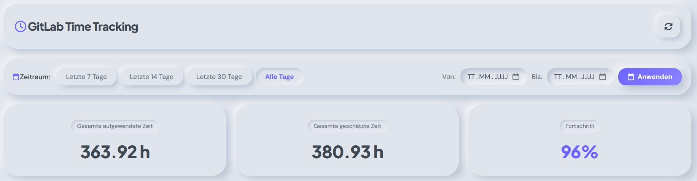
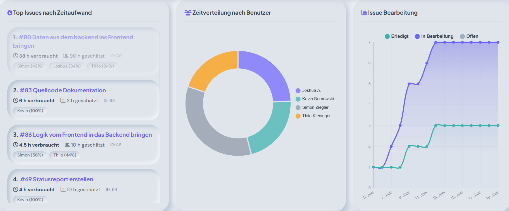
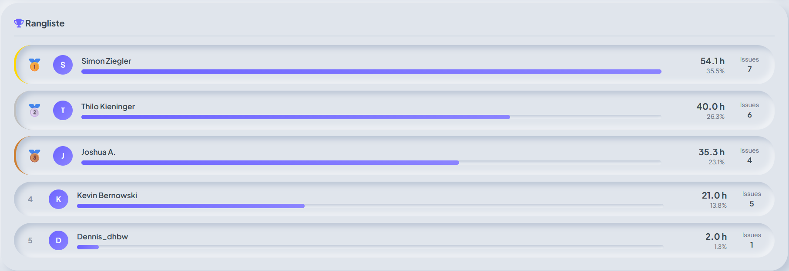

# GitLab Time Tracking Dashboard

Ein interaktives Dashboard zur Visualisierung und Analyse von Zeiterfassungsdaten aus GitLab Epics und Issues.

## Installation

### Voraussetzungen

- Python 3.8 oder höher
- GitLab Account mit API-Zugriff
- Personal Access Token mit `read-api` Scope
- Gemini API KEY (optional)

## ⚙️ Konfiguration

### Schritt 1: `.env` Datei erstellen

Erstellen Sie eine `.env` Datei im Projektverzeichnis (Referenz: `.env.example`):

```env
TOKEN=ihr_gitlab_personal_access_token
GROUP_FULL_PATH=obergruppe/ihre-gruppe/ihre-untergruppe
EPIC_ROOT_ID=8
REPOSITORY_NAME=ihr-projekt
GEMINI_API_KEY=gemini-api-key
```

### Schritt 2: GitLab Personal Access Token erstellen

1. Gehen Sie zu **GitLab.com** → **Benutzereinstellungen** → **Access Tokens**
2. Klicken Sie auf **"Add new token"**
3. Geben Sie einen Namen ein (z.B. "Time Tracking Dashboard")
4. Wählen Sie die **Scopes**:
   - ✅ `read_api`
5. Klicken Sie auf **"Create personal access token"**
6. **Kopieren Sie den Token** und fügen Sie ihn in die `.env` Datei ein

### Schritt 3: Gruppe und Epic konfigurieren

- **`GROUP_FULL_PATH`**: Der vollständige Pfad Ihrer GitLab-Gruppe
  - Beispiel: `my-organization/my-team`
  - Finden Sie diesen unter: GitLab → Ihre Gruppe → Einstellungen → Allgemein
  
### Hardcode ändern

- in `app.py` -> [332] target_matrix_labels = ["Entwurf", "Implementation & Test", "Projektmanagement", "Requirements Engineering"]


> [!IMPORTANT]
> If deploying on a server with `unicorn`, make sure to add a timout of min `120s` or even `180s` to make sure the AI dosn't timeout


## Screenshots


*Dashboard-Übersicht mit eingetragenen Zeiten und angesetzten Zeiten*


*Top Issues, Zeitverteilung nach Benutzern und Issue Verlauf*


*Rangliste basierend auf der aktuellen ausgewählten Zeit*
